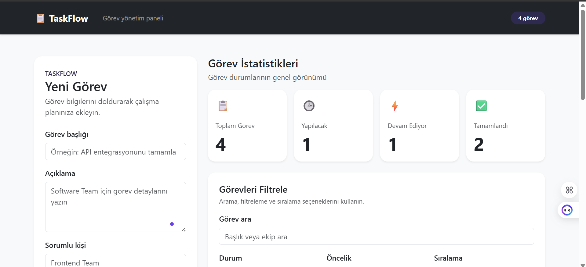
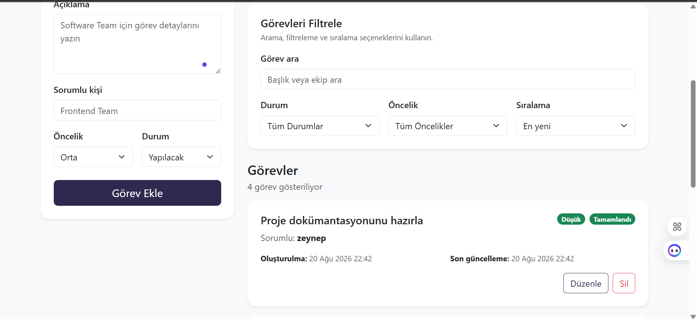
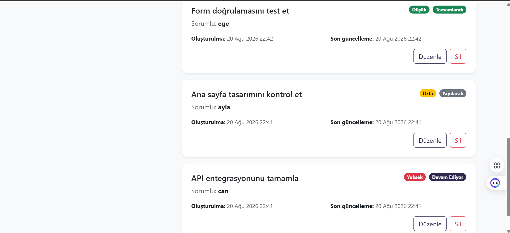

# TaskFlow

TaskFlow, React ve Bootstrap 5 kullanılarak geliştirilmiş bir görev yönetim uygulamasıdır.

Kullanıcılar görev oluşturabilir, listeleyebilir, düzenleyebilir ve silebilir. Görevler durum ve öncelik bilgileriyle yönetilebilir; arama, filtreleme ve sıralama özellikleri sayesinde görev takibi kolaylaştırılır.

Veriler LocalStorage üzerinde saklandığı için sayfa yenilendiğinde görevler korunur.

---

## Özellikler

- Görev ekleme
- Görev listeleme
- Görev güncelleme
- Görev silme
- LocalStorage ile veri saklama
- Başlık ve sorumlu kişiye göre arama
- Duruma göre filtreleme
- Önceliğe göre filtreleme
- Görevleri sıralama
- Görev istatistiklerini görüntüleme
- Form doğrulama
- Responsive kullanıcı arayüzü

---

## Kullanılan Teknolojiler

- React
- Vite
- JavaScript
- HTML
- CSS3
- Bootstrap 5
- LocalStorage
- Git
- GitHub
- Netlify

---

## CRUD İşlemleri

Projede temel CRUD işlemleri uygulanmıştır:

- **Create:** Yeni görev ekleme
- **Read:** Görevleri listeleme
- **Update:** Mevcut görevleri düzenleme
- **Delete:** Görevleri silme

---

## Proje Yapısı

```text
taskflow/
│
├── frontend/
│   ├── public/
│   ├── src/
│   │   ├── assets/
│   │   ├── components/
│   │   │   ├── Navbar
│   │   │   ├── TaskCard
│   │   │   ├── TaskFilter
│   │   │   ├── TaskForm
│   │   │   ├── TaskList
│   │   │   └── TaskStats
│   │   │
│   │   ├── pages/
│   │   │   └── HomePage
│   │   │
│   │   ├── App.jsx
│   │   ├── main.jsx
│   │   └── index.css
│   │
│   ├── index.html
│   ├── package.json
│   ├── package-lock.json
│   └── vite.config.js
│
├── screenshots/
│   ├── taskflow-dashboard1.png
│   ├── taskflow-dashboard2.png
│   └── taskflow-dashboard3.png
│
├── .gitignore
└── README.md
```

---

## Kurulum

Projeyi bilgisayarınızda çalıştırmak için repository'yi klonlayın:

```bash
git clone https://github.com/hayatguler/Taskflow.git
```

Projenin frontend klasörüne geçin:

```bash
cd TaskFlow/frontend
```

Gerekli paketleri yükleyin:

```bash
npm install
```

Geliştirme sunucusunu başlatın:

```bash
npm run dev
```

Terminalde gösterilen yerel adresi tarayıcıda açarak uygulamayı kullanabilirsiniz.

---

## Ekran Görüntüleri







---

## Canlı Demo

https://curious-daffodil-7060e4.netlify.app/

---

## GitHub

Projenin kaynak kodlarına GitHub üzerinden ulaşabilirsiniz:

https://github.com/hayatguler/Taskflow

## Projenin Amacı

Bu proje, Web Geliştirme ve JavaScript eğitimi kapsamında öğrenilen modern frontend geliştirme konularını uygulamak amacıyla geliştirilmiştir.

Proje kapsamında React component yapısı, state yönetimi, props kullanımı, form işlemleri, CRUD işlemleri, LocalStorage, Bootstrap ile responsive tasarım ve Git/GitHub kullanımı uygulanmıştır.

---